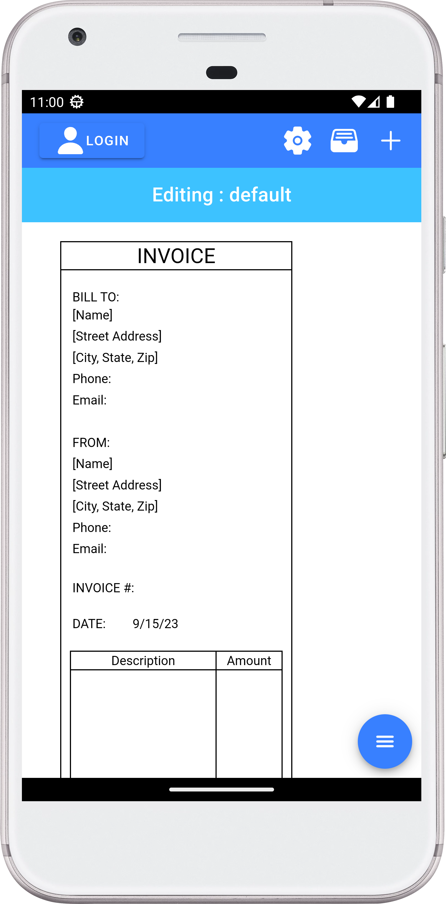

# App Preview



# Steps

```
1. git clone https://github.com/karanpreet710/GovtInvoice
2. cd GovtInvoice
3. npm i -g @ionic/cli
4. npm install
5. ionic capacitor open android(opens android studio with the application, build and run)
```
